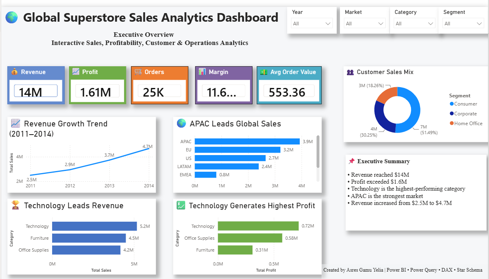

# 🌍 Global Superstore Sales Analytics Dashboard

Interactive Sales, Profitability, Customer & Operations Analytics built with Microsoft Power BI.

---

## 📌 Project Overview

This project delivers an end-to-end Business Intelligence solution using Microsoft Power BI and the Global Superstore dataset.

The solution includes:

- Data Cleaning with Power Query
- Star Schema Data Modeling
- Fact & Dimension Tables
- DAX Measures & KPIs
- Interactive Dashboard Pages
- Executive-Level Business Insights

The dashboard enables stakeholders to:

- Monitor Revenue & Profitability
- Analyze Product Performance
- Evaluate Geographic Performance
- Understand Customer Behavior
- Optimize Shipping & Operations
- Support Data-Driven Decision Making

---

## 📂 Dataset

**Source:** Kaggle

**Dataset:** Global Superstore Sales Dataset

https://www.kaggle.com/datasets/aditisaxena20/superstore-sales-dataset

---

## 🛠 Tools Used

- Microsoft Power BI
- Power Query
- DAX
- Data Modeling
- Data Visualization
- Business Intelligence

---

## 📊 Data Model

The dashboard follows a **Star Schema** design.

### Fact Table

- FactSales

### Dimension Tables

- DimDate
- DimCustomer
- DimProduct
- DimGeography
- DimShipping

### Data Modeling Features

- One-to-Many Relationships
- Surrogate Keys
- Fact & Dimension Architecture
- Date Dimension
- Slicer Synchronization

---

## 📈 Dashboard KPIs

### Revenue Metrics

- Total Revenue
- Total Orders
- Average Order Value
- Revenue Growth Trend

### Profitability Metrics

- Total Profit
- Profit Margin %
- Profit by Category
- Profit by Market

### Customer Metrics

- Customer Segmentation
- Top Customers
- Customer Revenue Contribution

### Operational Metrics

- Shipping Cost Analysis
- Sales by Ship Mode
- Profit by Ship Mode
- Order Priority Analysis

---

# 📄 Dashboard Pages

## 🌍 Executive Overview

Provides an executive summary of business performance.

### Highlights

- Revenue KPI
- Profit KPI
- Orders KPI
- Profit Margin
- Revenue Growth Trend
- Market Performance
- Customer Sales Mix
- Executive Summary

---

## 📦 Product Performance

Analyzes category, sub-category, and product performance.

### Highlights

- Revenue by Sub-Category
- Profit by Sub-Category
- Top 10 Products by Revenue
- Top 10 Products by Profit

---

## 🗺️ Geographic Performance

Analyzes revenue and profitability across markets, regions, and countries.

### Highlights

- Revenue by Market
- Profit by Market
- Revenue by Region
- Profit by Region
- Top 10 Countries by Revenue
- Top 10 Countries by Profit

---

## 👥 Customer Insights

Provides customer-focused analytics and segmentation insights.

### Highlights

- Revenue by Segment
- Profit by Segment
- Customer Sales Mix
- Top 10 Customers by Revenue
- Top 10 Customers by Profit

---

## 🚚 Shipping & Operations

Evaluates shipping efficiency and operational performance.

### Highlights

- Revenue by Ship Mode
- Profit by Ship Mode
- Shipping Cost Analysis
- Revenue by Order Priority
- Profit by Order Priority

---

## 🧹 Data Preparation

Power Query was used for:

- Data Quality Validation
- Duplicate Removal
- Data Type Corrections
- Dimension Table Creation
- Fact Table Construction
- Data Transformation
- Data Cleaning

---

## 🧠 DAX Measures

Examples used in the dashboard:

```DAX
Total Sales =
SUM(FactSales[sales])

Total Profit =
SUM(FactSales[profit])

Total Orders =
DISTINCTCOUNT(FactSales[order_id])

Total Quantity =
SUM(FactSales[quantity])

Profit Margin % =
DIVIDE([Total Profit],[Total Sales],0)

Average Order Value =
DIVIDE([Total Sales],[Total Orders],0)
```

---

## 📸 Dashboard Screenshots
### 🌐 Executive Overview



---

### 📦 Product Analysis


---

### 🗺️ Geographic Performance


---

### 👥 Customer Insights


---

### 🚚 Shipping & Operations


🎯 Skills Demonstrated

- Power BI
- Power Query
- DAX
- Star Schema Design
- Data Modeling
- Data Visualization
- Dashboard Design
- Business Intelligence
- Analytics Storytelling
- KPI Development

---

## 📁 Project Structure

```text
powerbi-superstore-sales-dashboard/
│
├── dashboard/
│   └── Superstore_Sales_Dashboard.pbix
│
├── data/
│   ├── DATASET.md
│   └── SuperStoreOrders.csv
│
├── screenshots/
│   ├── 01-executive-overview.png
│   ├── 02-product-performance.png
│   ├── 03-geographic-performance.png
│   ├── 04-customer-insights.png
│   └── 05-shipping-operations.png
│
├── LICENSE
├── README.md
└── .gitignore
```

---

## 🚀 Future Enhancements

- Sales Forecasting
- Customer Lifetime Value (CLV)
- RFM Analysis
- Geographic Mapping Visuals
- AI-Powered Insights
- Advanced Profitability Analytics

---

## 👨‍💻 Author

**Asres Gamu Yelia**

GitHub:

https://github.com/asres-analytics

---

## 📜 License

This project is licensed under the MIT License.

See the LICENSE file for details.

---

## 📚 Dataset Attribution

This project uses the Global Superstore Sales Dataset available on Kaggle:

https://www.kaggle.com/datasets/aditisaxena20/superstore-sales-dataset

The dataset remains the property of its original author and is subject to the licensing terms provided on Kaggle.

---

## ⭐ Key Highlights

- End-to-End Power BI Dashboard Development
- Power Query Data Cleaning & Transformation
- Star Schema Data Modeling
- Fact & Dimension Table Design
- Date Dimension Creation
- DAX KPIs & Business Metrics
- Interactive Multi-Page Dashboard
- Slicer Synchronization Across Pages
- Executive-Level Business Storytelling
